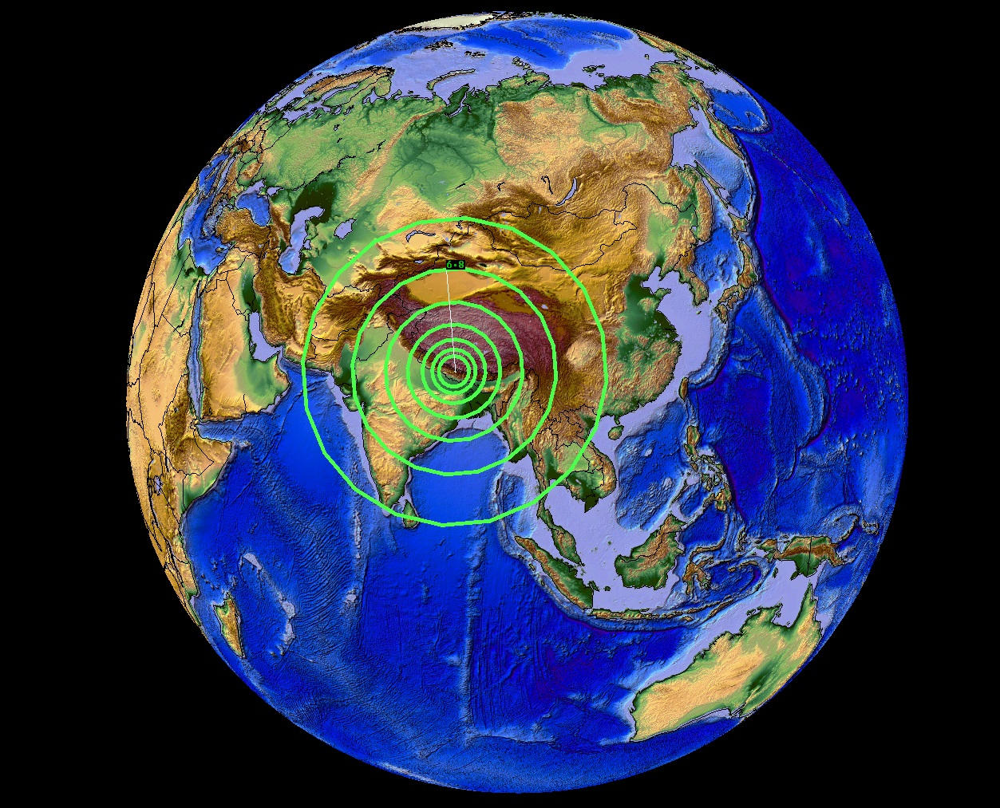
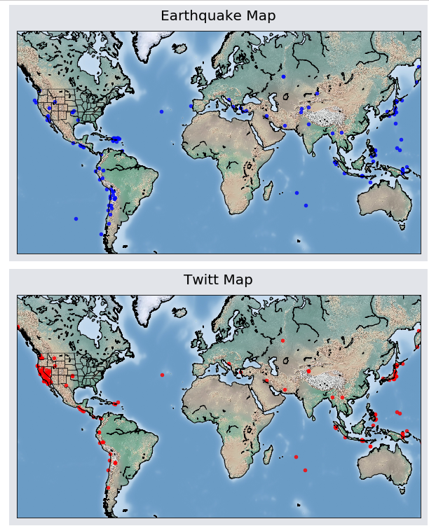

# Estimating Earthquake Locations Using Twitter Data and Affinity Propagation

Seismographs (instruments used for recording seismic signals) continuously record velocity of ground motions at different locations. When the ground shaking at a particular seismic station exceeds a predefined threshold, a seismograph gets triggered and transmit an alert to a data center. Triggering of multiple instruments at different stations over an area within a relatively short period of time usually indicates the occurrence of an earthquake. The transmitted seismic signals from multiple stations need to be processed further to estimate the earthquake hypocenter.

However, this process can be time-consuming (takes a few to several minutes) and moreover there are many places around the world with not a good coverage of seismic stations. 

The main idea here is to use the first order reports of an earthquake occurrence in the social media by people who actually felt it, for a rapid/rough estimation of earthquake location. Due to the speed of post creations and ease of near real-time access, using social media such as Twitter can be a potential for gaining situational awareness following disasters.

Here I present a simple way to do this without any need for steam of the data or NLP or training data set.

-----------------------------------------

# Part 1: Getting the Twitter Data

There are several ways to do this. Here I use `tweepy`
You need to create an account for Twitter API first and use your consumer and access information for connecting the Twitter API. (here I deleted mine!)

we search Twitter API for the word "earthquake" in 23 different languages:

`search_phrases = ['earthquake', 'sismo', 
                     'quake', 'temblor',
                     'terremoto', 'tremblement',
                     'erdbeben', 'deprem',
                     'σεισμός', 'seismós',
                     'séisme', 'zemljotres',
                     'potres', 'terremot',
                     'jordskjelv', 'cutremur',
                     'aardbeving', '地震',
                     'भूकंप', 'زلزال', 
                     'tremor', '지진', 'زلزله' ]`
 
To retrive dat from Twitter we first need a tweet Id as a 'starting point' from which to search. 
`get_tweet_id()` function finds the ID of a tweet that was posted at the end of a given day.

Twitter limits the maximum number of tweets returned per search to 100. 
`tweet_search()` function searches for up to max_tweets=100 tweets. 
Whenever it reached the max_tweets limit, it will pause for 15 minuts and then resume the search.

-------------------------------------------

# Part 2: Getting the Earthquake Data 

Again there are several ways for doing this using different options for downloading earthquake catalogs from international data centers such as ISC (http://www.isc.ac.uk/), using national catalogs like comcat, using official API of Us Geological Survey, or accessing to different apps. 

Here, I do it in the easiest way, using Us Geological Survey's web service. 
Simply we just need to generate something like this:

`http://earthquake.usgs.gov/fdsnws/event/1/query.csv?starttime=2000-01-01%2000:00:00&endtime=2015-1231%2023:59:59&maxlatitude=50&minlatitude=24.6&maxlongitude=-65&minlongitude=-125&minmagnitude=3&eventtype=earthquake&orderby=time-asc`

to search for the earthquake information for the same time period and then retrieve the data and store it in a local directory. 
________________________________

# Part 3: Analyzing the Downloaded Data
Our goal is to detect earthquakes based on evidences of firsthand felt reports from Twitter. So we need to identify tweets originating from users who experienced earthquake shaking like this one:

To minimize such contamination with the twitter activities following the release of news or blog articles, we remove all tweets that contain Uniform Resource Locators (URLs), specifically the
string “http”. 

Furthermore, we remove all tweets with the text “RT” or “@”. “RT” is commonly used to identify a tweet 
as a rebroadcast or “retweet” of another users tweet and the “@” symbol is used in front of a username to reply to another user’s tweet. 
Thus tweets containing “@” and “RT” are likely to arise from a user commenting on an earthquake from outside the felt area.

Filtering tweets with these keywords out, we archive the tweet creation time, text, and coordinates into a dataframe.

----------------------------------

# Part 4: 3D Clustering

After filtering of the Twitter data, an unsupervised clustering incorporating temporal/spatial dimension of the data can further help us in identifying earthquake activities. 

I use affinity propagation (Frey and Dueck, 2007) for the clustering. 
This method is based on the concept of "message passing" between data points and finds "examplars" of the input set that are representative of clusters.

AP simultaneously considers all data points as potential exemplars. Considering each data point as a node in
a network, this method recursively transmits real-valued messages (similarity measurements) along edges of the network until a good set of exemplars and corresponding clusters emerges.

I use this algorithm because unlike other clustering algorithms such as k-means, affinity propagation does not require the number of clusters to be determined or estimated before running the algorithm. 

Brendan J. Frey and Delbert Dueck (2007) “Clustering by Passing Messages Between Data Points”, Science.

-----------------------------------------

# Part 5: Results

Not bad, yeah

