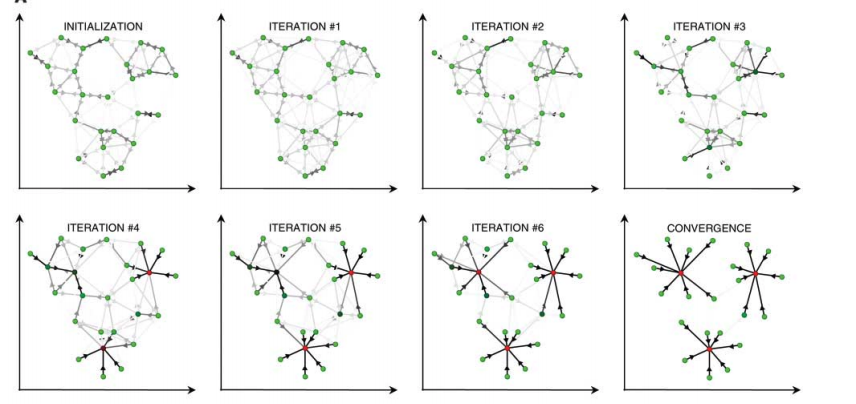

# Earthquake-location-estimation-using-Twitter-Activities

Due to the speed of post creations and ease of near realtime access, using social media such as Twitter can be a potential for gaining situational awareness following disasters.

Here I preset a simple way to do this witout any need for steam of the data or NLP or training data set.

we search Twitter API for the word "earthquake" in 23 different languages:

`search_phrases = ['earthquake', 'sismo', 
                     'quake', 'temblor',
                     'terremoto', 'tremblement',
                     'erdbeben', 'deprem',
                     'σεισμός', 'seismós',
                     'séisme', 'zemljotres',
                     'potres', 'terremot',
                     'jordskjelv', 'cutremur',
                     'aardbeving', '地震',
                     'भूकंप', 'زلزال', 
                     'tremor', '지진', 'زلزله' ]`
                     
Our goal is to detect earthquakes based on evidences of firsthand felt reports from Twitter. So we need to identify tweets originating from users who experienced earthquake shaking like this one:

To minimize such contamination with the twitter activities following the release of news or blog articles, we remove all tweets that contain Uniform Resource Locators (URLs), specifically the
string “http”. 

Furthermore, we remove all tweets with the text “RT” or “@”. “RT” is commonly used to identify a tweet 
as a rebroadcast or “retweet” of another users tweet and the “@” symbol is used in front of a username to reply to another user’s tweet. 
Thus tweets containing “@” and “RT” are likely to arise from a user commenting on an earthquake from outside the felt area.

Filtering tweets with these keywords out, we archive the tweet creation time, text, and coordinates into a dataframe.

# Clustering

I use affinity propagation (Frey and Dueck, 2007) for the clustering. 
This method is based on the concept of "message passing" between data points and finds "examplars" of the input set that are representative of clusters.

AP simultaneously considers all data points as potential exemplars. Considering each data point as a node in
a network, this method recursively transmits real-valued messages (similarity measurements) along edges of the network until a good set of exemplars and corresponding clusters emerges.

I use this algorithem because unlike other clustering algorithms such as k-means, affinity propagation does not require the number of clusters to be determined or estimated before running the algorithm. 

Brendan J. Frey and Delbert Dueck (2007) “Clustering by Passing Messages Between Data Points”, Science.

